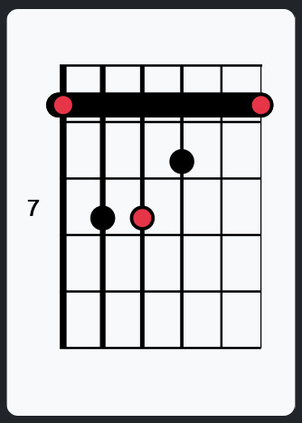

# G-Chords
#### Video Demo:  https://youtu.be/bS2VEbv0P7o
#### Description:
A web app using built with Flask to provide a movable chord shape dictionary and scale pattern reference for guitar players


#### Intro
I settled fairly quickly on the idea of creating an app to show guitar chord diagrams. Being a part time guitaristI thought it would be a great way to revisit the music theory side of playing which had definitely become very rusty. It also felt like a genuine chance to tackle a lot of new things in Python and build on the things we'd covered on the CS50 course. Since I had little idea at the beginning of the project on how this would pan out, apart from a few vague ideas about using a
database and some kind of method to show diagrams of chord shapes I knew I'd be forced to research and learn new things and this felt suitably challenging. This app could also have a genuine utility outside of the course for me and anyone else who cared to use it which was another good reason to pursue it. It felt different to the usual kind of to-do lists, weather apps and calculators (no shade) and the like I feel this project is not so common.

With that being said I feel I can't avoid inclduing a crash course on musical theory here to help give some explanation of the code that will follow. I've tried to keep it as relevant as possible so it's not exhasuative by any means but should cover the parts of theory I've relied upon in this app.

#### Some notes beofre starting
In music we need to think of pitches being higher or lower. This is easy to grasp as an idea. On guitar it can become a little less intuitive because of the orientation of the instrument. The headstock, which because of the way the instrumnet is played, will nearly always point up is technically "down" the neck as by playing notes closer to the headstock you'll be lowering the pitch of the notes. Conversely, moving towards the body of the instrument will lead to higher pitched notes. This is moving "up" the neck despite the orientation almost certainly being a downward direction! Try to rememeber in terms of pitch. Up the neck = higher pitch, down the neck = lower pitch.

Annoyingly, the strings themselves seem to ignore this general rule. So the thickest string is 6 with the thinnest string being the 1st. So going up in pitch leades to a lowering of the string snumber.


#### Making a start
I was confident early on that using flask was the way to go from what I had seen on the course so far in the Birthdays and Finance tasks. I felt the challenge was going to be in creating the diagrams and building a database and getting to grips with querying my database.

In my head I wanted to aim for this kind thing as it's similar to diagrams I've seen in guitar chord dictionaroes and online elsewhere.




#### Super quick crash course on musical theory
In so called "Western" music we have 12 notes. The 12 notes are called the Chromatic scale. The note you start on is the root note.

C Chromatic Scale:


```
R   1    2   3    4   5   6    7   8    9   10   11  12
C   C#   D   D#   E   F   F#   G   G#   A   A#   B   C
    Db       Eb           Gb       Ab       Bb
```

This pattern repeats both ascending and descending. If you play a note 12 steps higher you're said to be in the next Octave. If you play a note 12 steps lower
you're in the Octave below. 24 notes higher is 2 octaves up and so on.

#### Scales
Scales are really just a subset of the notes of the Chromatic scale. Think of the Chromatic scale like spices in your cookery cupboard. Cooking a meal
with all of them may be interesting in some way but it will be overpowering and unlikely to have a clear flavour. The musical equivalent
would be playing any random note you like, whenever you like and
it almost certainly would not, unless by cosmic level fluke, sound like music. Many people have heard of the Major scale, the famous Do - Ra - Me - Fa - So - La - Ti - Do.


It has a pattern written in Tones (2 note distance) and Semitones (1 note distances)


The Major Scale:
```
T - T - S - T - T - T - S
```


Therefore the notes of C Major for example are determined as below using tones and semitones:


```
C   C#   D   D#   E   F   F#   G   G#   A   A#   B   C
|   T    |   T    | S |   T    |   T    |   T    | S |
v        v        v   v        v        v        v   v

C        D        E   F        G        A        B   C

```
Note we've gone from 12 notes to 7.


Notice C Major gives all natural notes, so no notes with a sharp sign (#) or flat (&#9837;) sign. # means the note has a semitone added, therefore it's higher in pitch than it's natural equivalent. &#9837; means the note has a semitone removed, so it's lower in pitch than its natural equivalent.
This is why C Major is nearly always used as the easiest example to understand - it has no #'s or &#9837;'s. All the other scales will have some number of sharps or flats or occasionally both, yikes.


The key thing to grasp is that the pattern of the major scale doesn't change. Depending on where you start the major scale determines which notes you get, but
the intervals always remain the same. Just remember: T T S T T T S

Other scales have a defined pattern of tones and semitones that determine which notes you'll be using.

Re-cap: to obtain the notes of a scale, begin with the chromatic scale starting on the same root note as the scale you want. Apply the tone / semitone pattern
and you end up with the notes of the specific scale you wanted.


#### Quick side note
When writing out the notes of a scale there's a rule saying we should only use each type of note once. So in the C Major example
above, that happens automatically. In other scales you may end up with C _and_ C#, for example, so what you need to do is now consider C# as D&#9837;.
It _is_ the same note in all but name, and we do this to avoid using the same note name twice in a scale. This can be confusing, and we don't need to go super
deep into this, but you can get by just knowing to use each note name once and use &#9837; and # to make that happen. Occasionally you may need 2 #'s or &#9837;'s.


#### Intervals
Hand in hand with notes is the idea of _intervals_. In musical theory an interval is the _distance between_ 2 notes. An interval's key property is its sound.


All the intervals also have a name.


Redrawing the table above to show interval names without actual notes:


```
R    1    2    3    4    5    6    7    8    9    10    11   12
  m2   M2   m3   M3   P4   b5   P5   m6   M6   m7    M7    R


Key:

m2 = minor 2nd
M2 = Major 2nd
m3 = minor 3rd
M3 = Major 3rd
P4 = Perfect fourth
b5 = Flat 5th
P5 = Perfect 5th
m6 = Minor 6th
M6 = Major 6th
m7 = minor 7th
M7 = Major 7th
R = Root / Octave / Unison
```
Note the convention to use upper case for intervals named Major and lower case for intervals named minor.

For example:
if you play C and then C# (or D&#9837;!) it will sound a certain way. What it should sound like is the Jaws movie theme especially if played sufficiently low in pitch! What's interesting about this is that if then you played E then F, two totally different notes but again they are exactly one note apart you will hear the same quality; you will hear Jaws again, just of a different pitch. For any two notes one note apart you have the essence of "Jaws". The minor 2nd sound _is_ Jaws. The Major 3rd _is_ the beginning of "When the Saints go Marching in", the perfect 5th _is_ the beginning of Star Wars and so on. The pitches may be different to the  original piece i.e. higher or lower but the important part is the relationship between the root note and the next note is what gives the interval its identifiable quality.

#### Chords and keys

If scales are a subset of the chromatic scale, chords are a subset of the scale. In the Major scale example above we now have seven notes. We can create
7 chords from that scale. Each chord takes as a root each note in the scale.

For C Major we have therefore can build chords with roots:

```
I    ii    iii    IV    V     vi     vii
C    D     E      F     G     A      B
```

The numbering on top shows us whether a Major or minor chord results. This will become more clear as we go.

We build chords by stacking alternate notes on top of on another from the scale, sometimes referred to as stacking thirds on top of on another. It's worth remembering that Chords have 3 or more notes. On guitar we do have something called power chords, these are 2 note "chords" often used in rock and pop. Stricly they're not chords
as they only contain 2 notes. For our purposes when I say chord I mean 3 or more notes _different_ notes. Often notes can be duplicated, so a chord may include 2 or 3 root notes but they will be of different octaves. In terms of function each duplicate note does the same job and doesn't give rsie to a new shord type as adding in a different note would.

Here's how we find the chord based on C:

```
C D E F G A B
|   |   |
v   v   v

C   E   G
```
we take alternate notes from the scale starting on C which gives C - E - G

for the D chord we take alternate notes again simply starting on D:

```
C D E F G A B
  |   |   |
  v   v   v

  D   F   A

Which gives D - F - A
```

And so on. When you've done that 7 times you end up with the 7 chords of the major sacale.

From there you can go around again to make 4 note chords. There's nothing stopping you doing this:

```
C D E F G A B
|   |   |   |
v   v   v   v

C   E   G   B

Giving C - E - G - B
```

You can go on to do this:
```
C D E F G A B C D
|   |   |   |   |
v   v   v   v   v

C   E   G   B   D

Giving C - E - G - B - D
```

Remeber the scale just repeats so it's fine to add the D note from the octave above.

The example above, and all other chords of its kind where the higher notes have effectively gone beyond the root note and "looped" around the scale again
are called "Extended" chords. Extended chords should technically have the extended notes in the Octave(s) above the root note. So for example, in this chord the D
really needs to be at least 14 frets (or the equivalent) above the root C. On a pinao, at least 14 keys above the root C. That's not to say you can't have chords with
the D note within the same octave, you definitley can, but there's other considerations when doing so.

You could take this to a logical extreme and write out for every root note, a seven note chord. For each of those "chords" you're playing every note in the scale each time. The only difference would be what is considered to be the root note. You'd effectivley be playing the entire scale in one go, And you'd be back to using every spice in your spice rack.

In music, less is more.

However, writing out the scale 7 times, each time starting from a different note and including all 7 notes actually leads to 7 patterns of notes with 7 unique tone / semitone patterns. So within each Major scale there's actually 7 scales, each one having it's first note as one of the notes from the scale!. The key thing here is not to apply T - T - S - T - T - T - S to each note but only do this once for the Major scale you want.

For C we get
```
I    ii    iii    IV    V     vi     vii
C    D     E      F     G     A      B
```


for the scale hidden within the C Major scale based on D we simply start on D
```
ii    iii    IV    V     vi     vii   I
D     E      F     G     A      B     C
```
Then we identifiy the tone / semitone pattern arising from this new perspective on the scale as below (refer back to the chromatic scale above and find the tone / semtitone patterns for notes in C Major but starting from D):
```
New scale (C Major starting on D):     T - S - T - T - T - S - T

Major scale:                           T - T - S - T - T - T - S
```

Notice how it's different than the Major scale.

These hidden scales are called MODES.

If interested to learn more look up the concept of MODES on the internet.


#### Chords from Scales
Going back to our C - E - G example above, what intervals do we have? For this, always refer back to the Chromatic scale and think in terms of how
many notes apart is the interval you're looking at. Find the name for that "distance".

C to E is a Major Third. (4 notes apart)
C to G is a Perfect fifth. (7 notes aprt)

This is the formula for any major chord. Root, Major 3rd, Perfect 5th or:

```
R - M3 - 5
```

What about the chord based on D from the C Major scale?

We get D to F a minor 3rd (3 notes apart)

and D to A a perfect 5th. (7 notes apart)

```
C D E F G A B
  |   |   |
  D   F   A

R - m3 - 5
```

So the 2nd chord coming from the C major scale, with root D is actually a minor chord.

Continuing, we ultimately arrive at this pattern of chords arising from the Major scale:

```
Root - Major chord
2nd - minor chord
3rd - minor chord
4th - Major chord
5th - Major chord
6th - minor chord
7th - Diminished chord
```

No matter what root note of your Major scale, this pattern of chords arising from the Major scale is _always_ the same. This links back to the way the scales had roman numerals above each note earlier. THe CAPITALISED numerals indicate a Major chord at that position, lower case numerals indicate a minor of some type/

so for example F Major scale will give a sequence of chords:
```
F Major
G minor
A minor
B Major
C# Major
D Minor
E Diminished
```

The app is built on the basis that chords have these well defined formulas.

#### Chord names
Not all intervals are born equal. The most important interval in a chord is that between the first 2 notes. In C Major we get C to E. A major third.
This is _why_ the chord is called C major - because that first interval is a Major third interval. If we had had C to E&#9837; we now have a minor third.
C- E&#9837; - G is C minor. Only one note different to C Major but that Major  / minor third makes the chord go from happy and uplifting to a more
sad, melancholy sound.

There's lots of rules on how to name chords - I'll give a brief overview.
```
Chords with a Major third between the first 2 notes are always major of some type (Major 7, Major 9 etc...)
Chords that have a minor third between the first 2 notes are always minor of some type (minor 7, minor 9 etc)
If you have a major chord and add the 7th note to it, it's now a major 7 chord and that's the same with other extended notes
If you have a minor chord and add the 7th note to it, it's now a minor 7 chord and that's the same with other extewnded notes
If you have a Major chord and add the minor 7th note, you now have a 7th (seventh) chord.
If you have a Major or minor chord and change the M3 / m3 to a M2, you have a Sus 2 chord
If you have a Major or minor chord and change the M3 / m3 to a P4, you have a Sus 4 chord
Chords that refer to a ♭5 are literally saying take the P5 note and lower it a semitone. Do the opposite for #5, raise it a semitone
Once you go into "Extended" chords 2nd intervals become 9ths, 4ths become 11ths and 6ths become 13ths (think of these being an octave up).

```
Side note: The Major scale doesn't give rise to every type of chord in common (or not so common) usage. Other scales do that.

On a guitar, we only have 6 strings (most commonly), and as we've seen some chords can call for 7 notes. We have to therefore drop out some notes to play these types of chords. As mentioned previously the first 2 notes are the most important for the overall tonality and chord function so they can'd be omitted. The fifth however is the first that can reasonably be omitted. If you were looking at an extended chord say some kind of 9th or 13th chord, then the fifth can be omitted. So to play a 13th it's reasonable to look for the root, 3rd, 7th and 13th. These 4 notes will function as you intended. If you _could_ find a fingering to include a 9th by all means see how that sounds.

The app will therefore include chord formulas making the necessary omissions given the number of fingers and strings we have available.


#### Other Scales
This method of naming chords works for other scales too. So if you had a melodic minor scale, simply lay out the notes are per
the tone / semitone pattern. Build chords by using alternate notes. And those chords are the chords of the scale. Each scale
will give a different order of Major and minor chords and other types of chords we haven't seen yet will result from the
different pattern the scale is based on.

All of this ultimately gives rise to chords that are said to be in the "key" of a certain scale. So these chords:

 ```
F Major
G minor
A minor
B Major
C# Major
D Minor
E Diminished
```

allow you to play in the "key " of F Major.


#### On to Coding
In terms of displaying the graphics I did some research to get a feel for how I might do this. At one point I thought I might need a database that held links to images of chord diagrams, most likely a jpeg or possibly even photos of my own hands making the chord shapes, and these would be served to the user from a database. That felt like a huge amount of work to populate the database and definitely not the best use of a computer as it wasn't really doing anything for me, it was just serving a load of pre-existing data so I quickly moved on from that idea. I focused on trying to think how the computer would draw a diagram on the fly. I knew about canvases in HTML and instinctively felt I just needed multiple instances of a canvas I could draw upon. SVG's seemed to fit the bill as the diagrams would scale perfectly and retain its fidelity should a user zoom in, unlike jpgs and other bitmap graphics which would become pixelated.

After reading up on SVG's, this helped inform and clarify my approach for how to build the chord data. Since SVG's are drawn using a coordinates system, it made sense to store chord data that could be translated back into the circles and lines that would represent a standard guitar chord box. Since the guitar box was going to be some kind of grid to represent strings and frets, and that the basic grid wouldn't change, this seemed the best route forward. All I then needed to do was calculate the positions of circles and lines to represent where fingers and barres should go for each chord diagram. I knew I would need a way of storing the guitar chord information in a database to be served into the SVG.


Before getting to a guitar chord box, I needed some shorthand way of storing guitar chord information as per the example below:
```
022100
```
This is as bare bones as you can go but does gives a useful amount of information, Reading left to right it says this:


```
6th String 0 fret (open string)
5th String 2nd fret
4th String 2nd fret
3rd string 1st fret
2nd string 0 fret (open string)
1st String 0 fret (open string)
```


Guitarists make use of the fact that many guitar chords are "movable" shapes. Guitarists generally remember a range of shapes they can play to give them a major, minor, 9th, minor 13th etc etc chord sound. It's the shape of notes that is important to remember. If you play the example above which, incidentally, has its root note on the 6th string you're playing the E Major chord. This was the first chord I learned because it's the basis for Thin Lizzy's "The boys are back in Town" riff.  If you play the exact same shape, just at the 5th fret, so all the numbers are + 5 you get:


577655


It's now an A Major (A is 5 notes up from E, so by moving 5 frets you go from E Major to A Major).
My point in mentioning this is that the attribute of movable chord shapes would effectively cut my database
size down hugely and make my job easier overall. I don't need to have database entries for _every_ chord in every position on the neck.
I need one entry for the chord and can have Python calculate the fret number. It then becomes a problem
about presenting the user with the correct fret number on a chord diagram which will otherwise remain largely the same.


Given that chords have 2 variables; their root name and the chord family, that's all I need from the user to show them the chord diagrams
they want to see. So my user interface simply asks for those 2 things and nothing more. I did think of a grid of buttons and chord types
but went with a dropdown because it doesn't take up much space in comparison. I had an idea about usability on a phone being important so
the UI needed to be uncluttered.


I also started to get an idea of how to represent the guitar in the computer's memory. I thought of a couple of ways. I could either represent a guitar
neck in standard tuning with intervals or with notes. I felt notes were a bit easier to deal with as they are a little bit less abstracted.

```
guitar_neck = {
    "1": ["E","F","F#","G","G#","A","A#","B","C","C#","D","D#","E","F","F#","G"],
    "2": ["B","C","C#","D","D#","E","F","F#","G","G#","A","A#","B","C","C#","D"],
    "3": ["G","G#","A","A#","B","C","C#","D","D#","E","F","F#","G","G#","A","A#"],
    "4": ["D","D#","E","F","F#","G","G#","A","A#","B","C","C#","D","D#","E","F"],
    "5": ["A","A#","B","C","C#","D","D#","E","F","F#","G","G#","A","A#","B","C"],
    "6": ["E","F","F#","G","G#","A","A#","B","C","C#","D","D#","E","F","F#","G"],
}
```

#### App.py

What felt like my first big challenge was understanding how to get my database data into Python. Before I extracted all the chords to
the separate chords.cvs database I had a handful of "test" chords in a list similar to this which were easy to access. This was super easy to use and visualise
but would lead to a very cluttered app.py so it made sense to extract this part and place it in its own csv.file to act as a database.

I should add I did consider a program to actually create the database as I could see the need to manually type in a hundred or so chord formulas. However,
when I thought how long it would take me to implement that vs simply typing them in I felt the manual route was the way to go. If I had tens of thousands of lines
to enter it would be different.

My chord data basic structure is below:

```
chords = [
            {
                "shape": "E",
                "root_string": "6",
                "family": "Major",
                "fret_modifier": "0",
                "notes": [0, 2, 2, 1, 0, 0],
                "barre": 6
            }
]
```
Since I found this easy to work with and picture in my head I set up my database to mimic this

My reading lead to this useful property when importing the database information:

```
db.row_factory = sqlite3.Row
```

Which handed dictionary like objects to be db variable and enables me to access them by column name rather than by index, which I found more intuitive.

My database table headings went through various iterations starting on:

shape, root_string, family, fret_modifier, notes, barre

I did look at implementing the C-A-G-E-D system hence the "shape" field but this didn't make sense in the end so was dropped. The other item I ultimately dropped
was "barre". I had intended this to store information of how to draw a barre (one finger holding down multiple strings). This was by far the trickiest part
of the entire app, for me at least and I spent weeks getting in all kinds of knots trying to implement all kinds of if else statements so the app drew a barre
in the right context. More on that later.

It also became clear that I needed to store the notes in a way that didn't use the "," delimiter as this would suggest to Python each note of the chord was under its
own heading. I just wanted one return with the six notes for each chord. Hence settling on the | separator.

Databse sample below:
```
root_string,family,fret_modifier,notes
4,Maj9,-1,X|X|1|0|3|1
5,7#9#5,-1,X|1|0|1|2|2
5,13th,-1,X|1|0|1|1|3
```

My databse just needed to know which string the root note was on, what family the chord was (major, minor, minor 7 etc) how the fret number was to be modified and
the notes.

My chord dictionary has 2 broad categories of chords within it. Those with a fret_modifier value of 0 and those with some other negative number. Chords with a 0 fret_modifier have their root note on the lowest fret used within the chord. When fret_modifier is -'ve it is saying, in terms of frets, how far down the neck
the lowest note of the chord is _in relation to the root_. So if there's a -3 fret_modifier, you can expect to see at least one note rendered on the fret 3 behind the root.

#### Overview of the app

On loading the app defaults to the chords page

Should a user select a root and family and hot the "Show Me!" button, the post request happens and the following occurs:

The grid route which deals with all the chords activity gets the root and family variables
from the html with:

```
root = request.form.get("root")  # get user selection root
family = request.form.get("family")  # get user selection family
```

Should either not be provided it will load up an error page and image.

next we pull information from the databse using the family variable to pull all data of that family of chords
```
cursor.execute("SELECT * FROM chords WHERE family = ?", (family,))
```

The following code gets the database information into db_chords  which can then be passed to the template for looping over and also deals with splitting the notes from this 0|2|2|1|0|0 and creating a regular list [0,2,2,1,0,0]
```
rows = cursor.fetchall() # get ALL family chord data and put into row variable
        # re-creates a dictionary from the chord data from the db
        for row in rows: # for each row in rows
            chord = { #chord dictionary =
                "root_string": row["root_string"], # key root_string gets row["root_string"]
                "family": row["family"], # key family get row["family"] etc
                "fret_modifier": row["fret_modifier"],
                # list comprehension.
                # takes each note in row but splits on the | delimeter.
                # for each character of that notes string it then says
                # "if the character is a digit" turn it into an int otherwise
                # it gets left as a character. This helps separate out
                # the fret numbers from "X" which represent a muted string
                "notes": [
                    int(character) if character.isdigit() else character
                    for character in row["notes"].split("|")
                ],
            }
            db_chords.append(chord) # db_chords gets the appended chord data for each chord in the family, now with
                                    # the notes string properley split
```

I passed the following to the template to be able to render the chord boxes as I wanted:

```
 return render_template(
            "grid.html",
            root=root,
            family=family,
            chords=db_chords,
            fret_number=fret_number,
            guitar_neck=guitar_neck,
            guitar_neck_flats=guitar_neck_flats,
            received_chord=received_chord,
            note_spans_=note_spans_,
        )
```

The grid template is set up to loop over "chords" (chords=chords_db) for however many chords there are within it i.e. rows of data. Variables that are needed and calls to functions / filters in app.py are processed at this stage so the calculations can be made for each chord box.

```
 
                
                
                
                
                
                
                
                
                
                
                
```

The SVG drawing starts here by plotting out a grid to represent the guitar neck.

```
 <svg viewBox="0 0 255 360" width="245" height="300" class="chords svg-element">
                        <rect x="0" y="0" rx="10" ry="10" width="100%" height="100%" fill="#F8F9FA" />

                        
                          <line x1="{{ 50 + i * 35 }}" y1="50" x2="{{ 50 + i * 35 }}" y2="300" stroke="black" stroke-width="{{ 6 - i }}" />
                        

    <!-- horizontal frets lines -->

                        
                        <line x1="47" y1="{{50 + (i * 50)}}" x2="226" y2="{{50 + (i * 50)}}" stroke="black" stroke-width="{{ 7 if fret_number == 0 and i == 0 else 2 }}" />
                        
```

Then we move on to drawing single notes or barre's to represent the chord itself. This proved by far the most challenging aspect for me.

Some chords can have 2 barres. And programming in the logic to place the barre's correctly was difficult. This is where the note_spans_ tuple comes into play. The function note_spans returns note_spans_ to the grid template. It does far too many things and needs to be re-factored. But it does work. It's easier to look at the values returned and explain why they're useful.

```
return (spans_dict, fingers, x_flag, x_indexes, not_x)
```

0. spans_dict is a dictionary of lists and for each element in the chord (i.e. the fret number) it says how many strings is spanned.
fingers counts how many fingers are needed to form the chord. It will add one if a barre is detected across the 0's in the chord formula. It will add 1 for all other instances of non zero values in the chord formula. So [0,2,2,1,0,0] will give +1 as a barre is detected with the 0's. It will then + 1 twice for the 2's and +1 once for the 1 giving 4 fingers total. This is used later to determine if a secondary barre in the chord as anything > 4 we will need to use 1 finger to press down more than 1 string.
1. x_flag is a bool and is there to simply say at least 1 "X" (muted string" has been detected)
2. x_idexes is a list giving the strings where the X's occur and is needed to determine if any of the barre's are split by the muted strings
3. not_x is a count of actual notes that are not X.

I tried for a long time to have logic within the grid.html decide on if to draw a barre or not but ultimately I had to calculate this and pass it in note_spans_ as a bool. So within note_spans_ if a true is appended to any particular span of notes, it's saying to the template draw this as a barre and not individual circles. Key considerations for drawing barres is below:

```
1. Not drawing barre's across any muted strings
2. Not using more circles to indicate finger placements than I had actual fingers
3. Drawing secondary barres that didn't cross any muted strings
4. Drawing secondary barres in situations where the total fingers required for the chord was going to be > 4
5. If the total figners required to draw the chord was <=4 I possibly didn't need any barre so could default to using all circles
```
I also had to ensure the correct placement of elements in the diagram. My grids to represent the guitar neck has strings placed 35 pixels apart. Frets are 50 pixels apart. Hence why my calculations use 50 and 35 a lot as to place things correctly it will nearly always require some multiple of 35 or 50.

#### Difficulties
At one stage I had a grid.html template that attempted to draw chord boxes dependant on how many notes were in the chord (4 ,5 or 6 notes). There was a lot of very similar code across these 3 code blocks. I had this working in about 97% of cases but for edge cases, specifically where there were 2 muted strings that weren't next to one another everyt time I made a correction it broke something somewhere else. So I basically started over and coded what I have now which at least works in all the cases I need and can handle different numbers of notes in one code block.

I had 2 other code blocks to draw intervals and note names under the chord boxes. I had to remove these as I couldn't get them working as intended. I need to correct the notes block to only use each letter of the scale once only. Some of my chord blocks will give say C AND C# when it should be C and Db. I think for this I need to program in the circle of fifths properly. Also, some extended chords have their extended notes in the lower octave so my interval names would show as a 2nd and not a 9th for example. I think that I will need a flag in the chord database as I don't think it can be calculated as to whether a chord is "extended". If the "extended" flag is set to True than any notes showing as 2, 4 or 6 should be written as 9, 11 or 13 respectively, something like that. Or it may be that a chord can be considered extended if the 3rd note is there AND the 2nd , therefore the 2nd now become the 9th. But to this point I haven't been checking which intervals are present.

#### future features and considerations

Learning:

I didn't plan enough. It's difficult to know when to stop thinking and start doing. Some of the issues I faced were definiteley solved by playing with the code as I  learnt as I went. Other times I had realised I had coded myself into a corner with code that was fundamnetlally flawed in its approach from the beginning and that felt like I hadn't thought it through enough at the start. The worst situations are when I wrote sloppy code then spent ages trying to figure out what it was actually doing, to then realise it was flawed in it's approach anyway - double whammy. Overall some more careful consideration and planning would not hurt me.

I have got better at walking through the code more slowly and sense checking the logic i.e. is this doing what I think it's doing at each stage.

Next time out I will make simpler functions that do less overall.

I have learnt to check the code after each small change to catch errors sooner.

I have a bit better feeling for some of the sublties of complex if else blocks now.

I have a bit of comfort with Flask now and am more comfortable with Pythin overall. I still need to look more into list comprehensions and the database stuff in the immediate future.

Features to add:

Open chords. The app is really missing a function to draw dbvx bwide interval open chords with unusual voicings.

Add a button for sound under each chord

Some theory text

button to rotate the neck diagram

More strings - user able to select number of strings

Finger numbers

Alternate tunings - show chord shapes for different tunings

Bass support.

I feel there's some more general purpose functions I could pull out of this, maybe even an API so opther users can give it a root note and chord type and it will return an SVG for them to use in their own programs.


